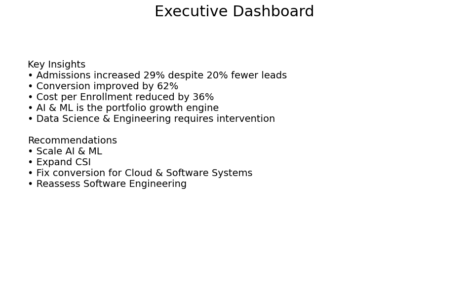
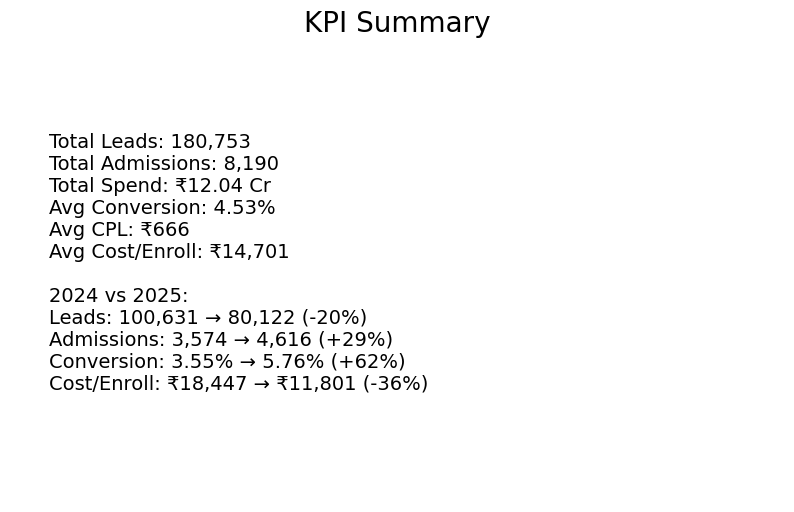
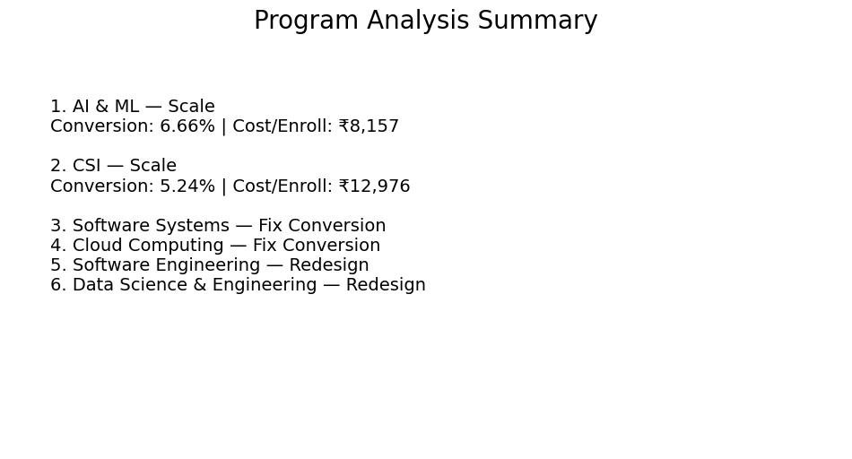
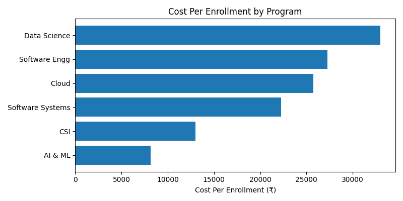
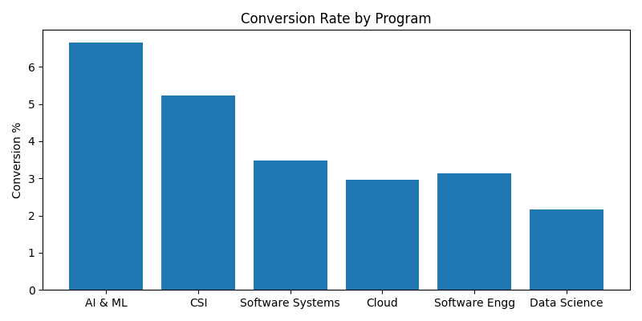
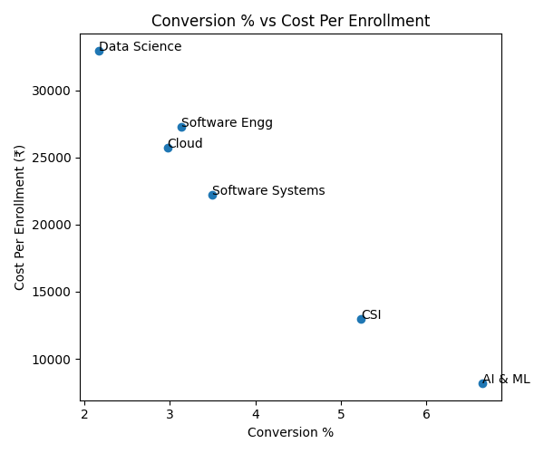

# Higher Education Marketing Analytics Case Study

> End-to-end marketing analytics project analysing 180,753 leads, 8,190 admissions, and ₹12.04 Cr in marketing spend to identify conversion drivers, enrollment economics, and program optimisation opportunities.

---

# Executive Dashboard

---

# Project Overview

This project evaluates marketing performance across six postgraduate academic programs and identifies opportunities to improve conversion efficiency, enrollment economics, and portfolio performance.

The analysis focuses on:

* Program-level performance evaluation
* Conversion optimization
* Enrollment cost analysis
* Portfolio prioritisation
* Executive decision support

---

# Business Objective

The objective of this analysis was to:

* Evaluate lead-to-admission performance
* Identify high-performing and underperforming programs
* Analyse enrollment economics
* Generate actionable business recommendations
* Build an executive dashboard for stakeholder decision-making

---

# Dataset Summary

| Metric            |     Value |
| ----------------- | --------: |
| Total Leads       |   180,753 |
| Total Admissions  |     8,190 |
| Marketing Spend   | ₹12.04 Cr |
| Academic Programs |         6 |
| Analysis Period   | 2024–2025 |

---

# KPI Summary

### Key Findings

* Admissions increased by 29% despite a 20% reduction in lead volume.
* Conversion improved from 3.55% to 5.76%.
* Cost per enrollment reduced by 36%.
* Growth was primarily driven by funnel efficiency rather than lead volume growth.

---

# Program Analysis

Programs were categorised into three strategic groups:

## Scale

Programs demonstrating strong conversion performance and favourable enrollment economics.

* AI & ML
* Computing Systems & Infrastructure (CSI)

## Fix Conversion

Programs generating demand but requiring funnel optimisation.

* Cloud Computing
* Software Systems

## Redesign

Programs requiring immediate intervention due to weak enrollment economics.

* Data Science & Engineering
* Software Engineering

---

# Cost Per Enrollment Analysis

### Insight

AI & ML delivers enrollments at nearly four times lower cost than Data Science & Engineering, making it the most efficient program within the portfolio.

---

# Conversion Rate Analysis

### Insight

AI & ML and CSI significantly outperform the portfolio average, demonstrating stronger lead-to-admission conversion efficiency.

---

# Conversion vs Cost Per Enrollment

### Insight

Programs with stronger conversion performance consistently achieve lower enrollment costs, indicating that conversion efficiency is a major driver of enrollment economics.

---

# Strategic Recommendations

## Scale

* Increase investment in AI & ML.
* Test additional budget allocation for CSI.

## Fix Conversion

* Improve admissions conversion processes for Cloud Computing.
* Optimise funnel performance for Software Systems.

## Redesign

* Reassess positioning and targeting for Software Engineering.
* Conduct detailed funnel analysis for Data Science & Engineering.

---

# Tools Used

* Google Sheets
* Pivot Tables
* Marketing Analytics
* KPI Analysis
* Business Analysis
* Dashboard Design

---

# Key Learnings

This project strengthened my ability to:

* Transform raw marketing data into actionable business insights.
* Evaluate portfolio performance using enrollment economics.
* Build executive dashboards for stakeholder communication.
* Translate analytical findings into strategic recommendations.
* Move beyond reporting and focus on business decision-making.

---

# Repository Contents

* Program Analysis.pdf
* KPI Summary Dashboard
* Program Analysis Dashboard
* Executive Dashboard
* Cost Per Enrollment Analysis
* Conversion Rate Analysis
* Conversion vs Cost Analysis

---

# Future Enhancements

Potential improvements for future versions include:

* Power BI implementation
* Automated reporting workflows
* Predictive enrollment forecasting
* Marketing attribution modeling
* Revenue impact simulations
